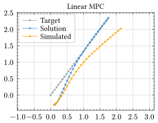
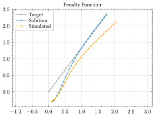
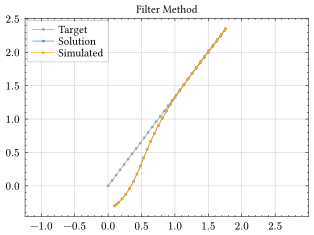
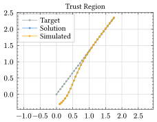

# Basic Usage

## Model Definition

### Simulation

## Linear MPC

## Nonlinear MPC

### Penalty Function

### Filter Method

### Trust Region

## Advanced Models

### Soft Constraints

### Discrete Models

### Discrete states

### Derivatives of States and Inputs
